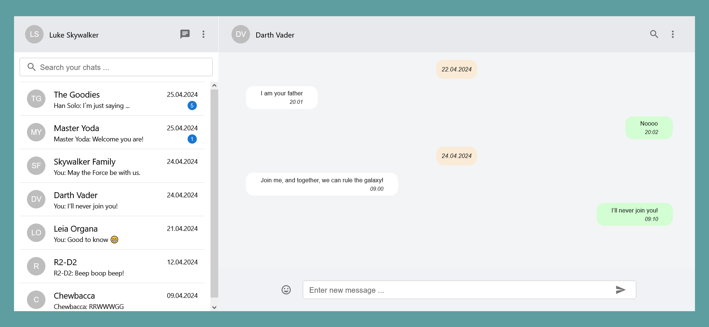
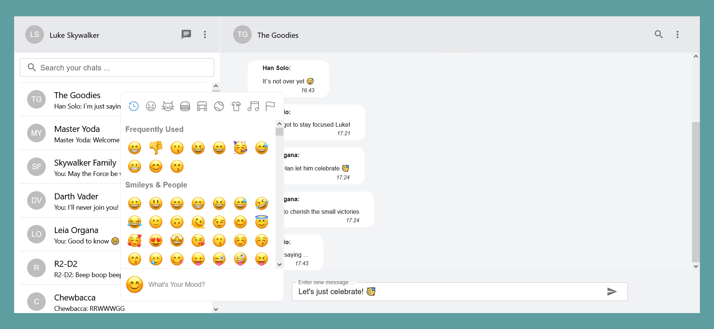
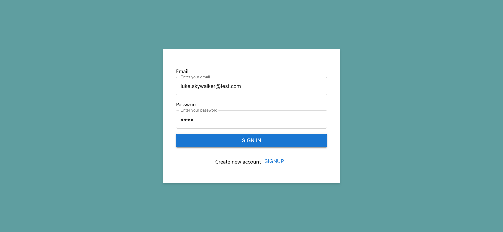
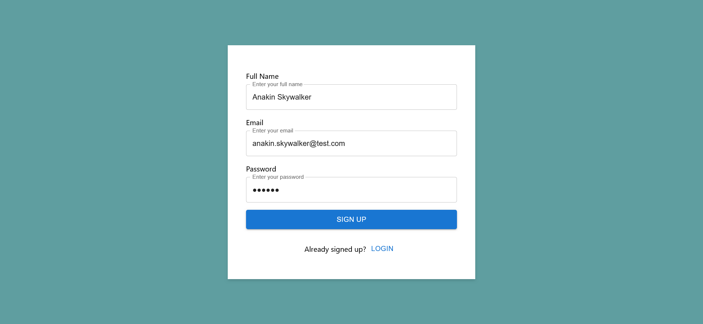
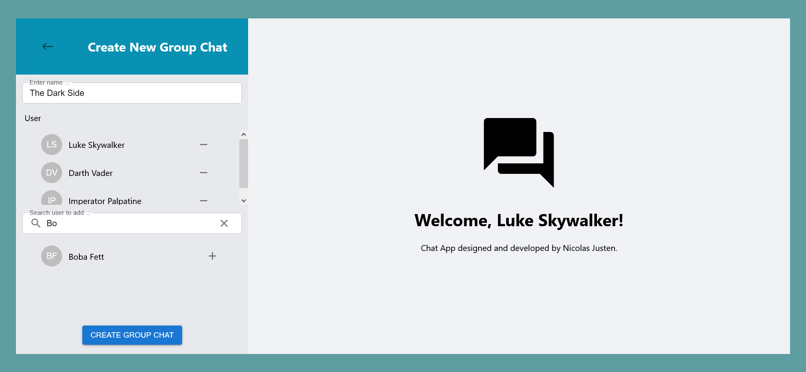
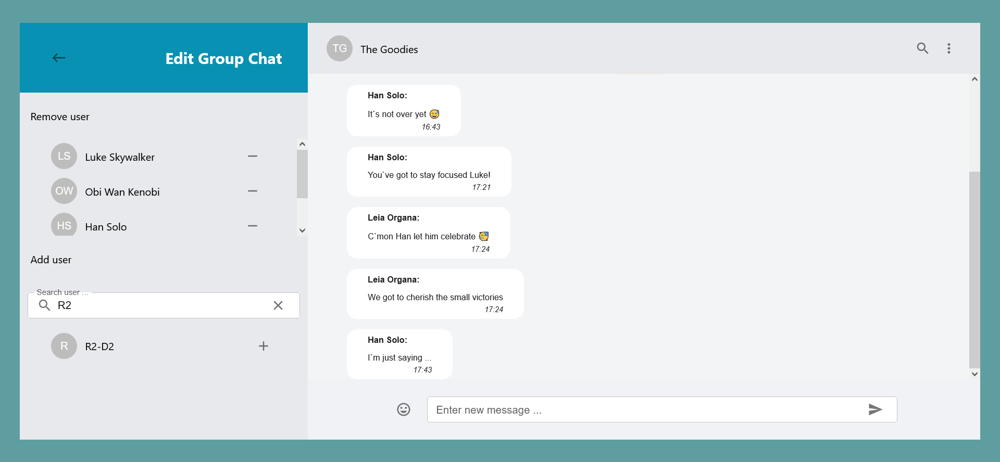

# Chat Application

Welcome to my Chat Application! This project is a full-fledged realtime messaging application with a user interface 
inspired by WhatsApp. It enables users to exchange messages individually or within groups.



## Features

- **Realtime Messaging:** Experience seamless, real-time messaging with instant message delivery.
- **Individual Messaging:** Send private messages to other users.
- **Group Messaging:** Create and edit groups to communicate with more than one user.
- **Login And Signup:** Securely access the application with a login and signup system.

## Technologies

- **Frontend:** Typescript with React
- **Backend:** Java with Spring Boot, Spring Security, Spring Websocket and Spring Data JPA
- **Database:** H2 (in-memory database for development)
- **Authentication:** JSON Web Token (JWT)
- **State Management:** Redux, Thunk
- **Component Library:** Material UI

## Getting Started

### Prerequisites

Ensure you have **npm** and **mvn** installed on your machine.

> **Note:** The application uses an H2 in-memory database that automatically initializes with test data on startup. No additional database configuration is required.

### Installation

1. **Clone the repository:**
    ```bash
    git clone https://github.com/RuslanKoledin/chatclone.git
    cd chatclone/chat-app
    ```
   
2. **Navigate to the Frontend and install the required dependencies:**  
    ```bash
    cd frontend
    npm install
    ```
   
3. **Navigate to the Backend and install the required dependencies:**  
    ```bash
    cd backend
    mvn clean install
    ```
   
4. **Run the Application:**

    First, start the backend (from the `backend` directory):
    ```bash
    cd backend
    mvn spring-boot:run
    ```

    Then, in a new terminal, start the frontend (from the `frontend` directory):
    ```bash
    cd frontend
    npm start
    ```
5. **Access the Application:**
   - Open your browser and visit [http://localhost:3000](http://localhost:3000) to use the Realtime Chat Application.
   - You can log in with one of the test accounts:
     - **Email:** `r.koledin@test.com` **Password:** `test`
     - **Email:** `b.bob@test.com` **Password:** `test`
     - **Email:** `a.tom@test.com` **Password:** `test`
   - Or create your own account and start chatting!

## Images

View your chats with other users:


Send messages to other users:


Log into your account:


Create a new account:


Start a new chat:


Edit your chats:


## Contribution Guidelines

I welcome contributions! If you have ideas for improvements or new features, feel free to open an issue or submit a pull request.

## License

This project is licensed under the [MIT License](LICENSE).

Thank you for using and contributing to the Realtime Chat Application!

 
